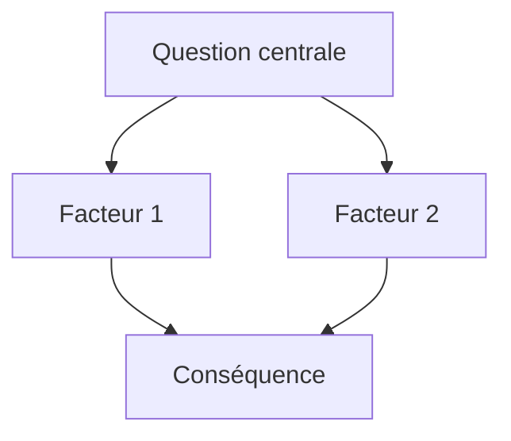

# Guide de rédaction des articles

Ce fichier s’adresse aux **agents IA** (et aux humains) qui aident Lucas à écrire des articles pour [deucalionn.github.io](https://deucalionn.github.io).

Le site est un blog **Astro** statique. Les articles sont du **Markdown enrichi** compatible OpenKnowledge : blocs `mermaid`, blocs `html preview`, sources publiées en pages dédiées.

**Article de référence :** `src/content/docs/bordeaux-cher/article.md`

---

## Structure de dossier

Chaque article vit dans son propre bundle :

```
src/content/docs/<slug-dossier>/
  article.md              # type: post
  sources/
    ma-source.md          # type: source (une page par source)
    autre-source.md
```

- Le **slug dossier** (`bordeaux-cher`) sert à l’organisation disque uniquement.
- Les **URLs publiques** viennent du champ `permalink` dans le front matter — pas du chemin disque.

---

## Squelette obligatoire d’un article

Respecter cet ordre. Ne pas sauter les sections clés.

### 1. Front matter YAML

Voir [Front matter article](#front-matter-article).

### 2. Pourquoi cet article

Bloc note en tête de corps :

```markdown
> [!NOTE]
> **Pourquoi cet article et cette analyse ?**
>
> [Contexte personnel ou professionnel : pourquoi Lucas s’intéresse au sujet, ce qu’il cherche à comprendre ou décider. Ton direct, à la première personne.]
```

### 3. Question principale

```markdown
## Question principale

**[La question centrale, formulée clairement]** — avec les nuances nécessaires :

- point de comparaison 1 [libellé source](sources/ma-source.md) ;
- point de comparaison 2 …

**Question secondaire :** [si pertinent]
```

Les liens inline vers les sources utilisent des **chemins relatifs** `sources/<fichier>.md`. Le site les résout automatiquement vers les permalinks.

### 4. Réponse courte

```markdown
## Réponse courte (avant d'entrer dans le détail)

[2–4 phrases : thèse principale, sans jargon inutile.]


```

Un diagramme mermaid de synthèse est recommandé ici.

### 5. Corps — sections numérotées

```markdown
## 1 · [Titre de section]

[Prose + graphiques]

---

## 2 · [Titre de section]
...
```

- Sections numérotées avec `·` (point médian).
- Sous-titres `###` pour les sous-parties.
- Séparateurs `---` entre grandes sections.

### 6. Verdict / notes intermédiaires

Pour les conclusions partielles ou mises en garde :

```markdown
> [!NOTE]
> **Verdict provisoire :** [synthèse courte et actionnable]
```

### 7. Conclusion

Tableau récapitulatif recommandé :

```markdown
## Conclusion

| Question | Réponse |
|----------|---------|
| … | … |
```

### 8. Sources

Liste groupée par type (presse, données officielles, etc.) :

```markdown
## Sources

### Presse et analyse

- [Titre lisible](sources/slug-source.md)

### Données et documents officiels

- [Titre lisible](sources/autre-source.md)
```

Chaque entrée doit correspondre à un fichier dans `sources/` **et** être listée dans le front matter `sources:`.

### 9. Pistes (optionnel)

```markdown
## Pistes

- Amélioration ou donnée manquante pour une future version.
```

---

## Front matter article

```yaml
---
type: post
category: immobilier          # voir Catégories
date: 2026-07-11
title: Titre de l'article ?
description: Résumé court pour SEO et cartes d'accueil (1 ligne).
permalink: /mon-slug-public/  # URL finale — choisir une fois, ne pas changer
sources:
  - sources/ma-source.md
  - sources/autre-source.md
tags: [mot-clé-1, mot-clé-2]
---
```

| Champ | Règle |
|-------|-------|
| `type` | Toujours `post` pour un article |
| `category` | Une seule catégorie principale (`immobilier`, `tech`, …) |
| `permalink` | Slug URL stable, descriptif, en kebab-case |
| `description` | Phrase unique, factuelle |
| `sources` | Chemins relatifs vers tous les fichiers `sources/*.md` cités |
| `tags` | 3–8 tags, minuscules, kebab-case si plusieurs mots |

---

## Sources

Chaque source est un fichier Markdown séparé, publié comme page à part entière.

```yaml
---
title: Titre court — origine ( média, année )
description: Ce que contient la source en une phrase.
type: source
source_url: https://…         # URL originale
date_fetched: 2026-07-11
preservation: text-extracted  # ou autre statut si pertinent
tags: [source, immutable, layer-ingest, …]
layout: page
permalink: /<slug-article>/sources/<slug-source>/
---
```

**Règles :**

- Le `permalink` de la source **doit** être préfixé par le permalink de l’article parent.
- Le slug source = nom du fichier sans `.md` (ex. `ladepeche-bordeaux-tgv-2017.md`).
- Corps : extrait ou résumé fidèle du contenu original sous `## Source`.
- Ne pas inventer de données : si une source manque, le signaler dans `## Pistes`.

---

## Catégories et tags

### Catégories

Catégorie = fil d’actualité principal. Une seule par article.

| Catégorie | Usage |
|-----------|-------|
| `immobilier` | Marché, investissement, logement, villes |
| `tech` | Développement, IA, outils, data |

Créer une nouvelle catégorie seulement si l’article n’entre clairement dans aucune existante. La page `/categories/<catégorie>/` est générée automatiquement.

### Tags

- Décrivant le **sujet** (villes, concepts, datasets), pas la catégorie en doublon.
- Cohérents entre articles (`bordeaux`, `toulouse`, `lgv`, `immobilier`, …).
- Pas de tags vides ou génériques (`article`, `blog`).

---

## Design des graphiques

**Objectif :** tous les articles doivent avoir des visuels cohérents entre eux — même palette, même typographie, même mise en page.

Le site injecte automatiquement les **tokens CSS OpenKnowledge** dans chaque iframe `html preview`. Utiliser **uniquement** ces variables, jamais de couleurs hex hardcodées pour le fond, le texte ou les séries.

### Tokens disponibles

| Token | Usage |
|-------|-------|
| `--chart-1` … `--chart-5` | Couleurs des séries (lignes, barres, légendes) |
| `--foreground` | Texte principal, axes |
| `--background` | Fond |
| `--card` / `--border` | Panneaux et bordures |
| `--muted-foreground` | Sous-titres, ticks, légendes secondaires |
| `--primary` | Accent ponctuel |
| `--destructive` | Valeurs négatives ou alertes |

Définis dans `src/lib/preview-tokens.mjs` (alignés sur OpenKnowledge).

### Assignation des couleurs de séries

Conserver la **même sémantique** d’un article à l’autre quand les entités se répètent :

| Série | Token suggéré |
|-------|---------------|
| 1re entité / ville de focus | `--chart-1` |
| 2e entité | `--chart-2` ou `--chart-3` |
| 3e entité | `--chart-3` ou `--chart-4` |
| Événement / marqueur (LGV, seuil) | `--chart-4` |
| Scénario / projection | `--chart-5` (ligne pointillée) |

### Gabarit CSS des blocs `html preview`

Reprendre cette base dans chaque graphique :

```html
<style>
body{margin:0;padding:16px;font-family:system-ui,sans-serif;color:var(--foreground);background:var(--background);font-size:12px}
h3{margin:0 0 2px;font-size:15px;font-weight:700}
.sub{color:var(--muted-foreground);font-size:11px;margin:0 0 12px;line-height:1.4}
.legend{display:flex;flex-wrap:wrap;gap:12px;margin-bottom:8px;font-size:11px}
.row{display:grid;grid-template-columns:1fr 1fr;gap:12px}
@media(max-width:600px){.row{grid-template-columns:1fr}}
.panel{border:1px solid var(--border);border-radius:8px;padding:8px 8px 4px;background:var(--card)}
.panel h4{margin:0 0 2px;font-size:10px;text-transform:uppercase;letter-spacing:.04em;color:var(--muted-foreground)}
svg.chart{width:100%;display:block}
</style>
```

### Conventions visuelles

- **Titre du graphique** : `<h3>§N — [Sujet]</h3>` (numéro de section aligné sur l’article).
- **Sous-titre** : `<p class="sub">Abscisse : … · Ordonnée : … · [conventions]</p>`.
- **Légende** : pastilles colorées `●` avec `var(--chart-N)`.
- **Grille** : lignes pointillées `var(--border)`, axes `var(--foreground)`.
- **Labels** : `var(--muted-foreground)`, taille 9–11px.
- **Panneaux** : grille 2×2 sur desktop, 1 colonne sur mobile.
- **Marqueurs d’événement** : tags en bas (ex. mise en service LGV).

### Diagrammes Mermaid

Pour les synthèses et arbres de causalité :

````markdown

````

- Labels courts (retours `<br/>` si besoin).
- Pas de couleurs custom Mermaid — le thème par défaut suffit.
- Un mermaid en **réponse courte**, d’autres si utile en cours de section.

---

## Blocs techniques

### HTML preview (graphiques interactifs)

````markdown
```html preview h=640px
<!DOCTYPE html>
<html lang="fr"><head><meta charset="UTF-8">
<style>…</style></head><body>
…
</body></html>
```
````

- `h=640px` (ou autre) fixe la hauteur initiale ; le script d’auto-resize ajuste ensuite.
- Document HTML **complet** (`<!DOCTYPE html>`, `<html>`, `<body>`).
- Pas de dépendances externes (CDN) : SVG + JS vanilla inline.
- Copier le gabarit CSS depuis l’article de référence, adapter les données — ne pas réinventer le layout.

### Liens vers les sources

| Contexte | Syntaxe |
|----------|---------|
| Dans le corps | `[Libellé](sources/ma-source.md)` |
| Front matter | `sources/ma-source.md` (sans crochets) |
| Permalink public | Généré automatiquement — ne pas hardcoder `/new-article/…` |

---

## Ton et langue

- **Français** pour tout le contenu publié.
- Ton analytique, direct, pas académique lourd.
- Première personne acceptable dans la note « Pourquoi cet article ».
- Corps de l’article : factuel, chiffré, sources citées.
- Distinguer clairement **faits**, **interprétations** et **scénarios** (A/B, verdict provisoire).
- Signaler les limites de données (interpolations, périmètre commune vs métropole).

---

## Checklist avant de livrer un article

- [ ] Dossier `src/content/docs/<slug>/` avec `article.md` + `sources/*.md`
- [ ] `permalink` article définitif et cohérent
- [ ] Note « Pourquoi cet article » en tête
- [ ] Question principale + réponse courte + mermaid de synthèse
- [ ] Sections numérotées, graphiques avec tokens CSS (--chart-N)
- [ ] Toutes les sources référencées existent et sont dans le front matter `sources:`
- [ ] Permalinks sources préfixés par l’article parent
- [ ] Section `## Sources` en bas, liens fonctionnels
- [ ] `category`, `tags`, `description` renseignés
- [ ] `npm run build` passe sans erreur

---

## Ce qu’il ne faut pas faire

- Changer un `permalink` déjà publié sans mettre à jour toutes les sources et liens.
- Utiliser des couleurs hex pour les graphiques à la place des tokens `--chart-*`.
- Citer une source sans créer le fichier `sources/*.md` correspondant.
- Mélanger plusieurs articles dans un même dossier.
- Lancer plusieurs `npm run dev` en parallèle (corrompt le cache Astro en dev).
- Hardcoder des URLs `/new-article/…` ou d’anciens slugs.
