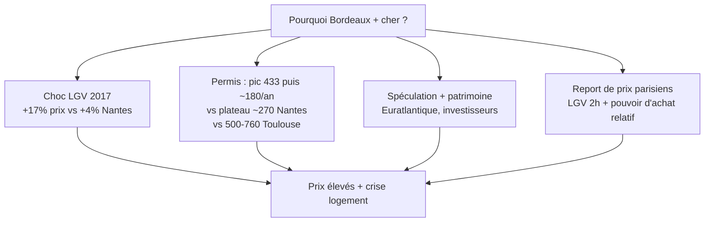

## Question principale

**Pourquoi Bordeaux reste-t-il nettement plus cher que Nantes et Toulouse** — avec une **crise du logement** visible — alors que :

- **Nantes** a reçu la **même LGV Paris-Ouest en 2017** (~2 h de Paris) ;
- **Toulouse** est devenue la **3e commune de France** (~515 000 hab.), portée par l'aéronautique et la croissance démographique la plus forte du pays [La Dépêche Tls](../external-sources/new-article/ladepeche-toulouse-3e-ville-2026.md) ?

**Question secondaire :** Toulouse va-t-elle connaître une **envolée des prix** d'ici 2030-2032 (LGV annoncée en 2022, service prévu 2032), sachant que **Nantes est déjà plus chère** qu'elle aujourd'hui ?

---

## Réponse courte (avant d'entrer dans le détail)

Bordeaux n'est pas cher parce qu'il est « plus grand » ou « plus dynamique » — **Toulouse l'est davantage sur ces deux critères**. Bordeaux est cher parce qu'en 2016-2017 il a cumulé un **choc LGV + report de prix parisiens** (pouvoir d'achat relatif) **+ effondrement de l'offre de construction**, sans jamais vraiment rattraper. Nantes a absorbé la LGV ; Toulouse a absorbé sa croissance par la **construction massive**.



---

## 1 · 2017 — La LGV arrive à Bordeaux et Nantes

**Juillet 2017** : ouverture de la LGV Paris–Tours–Bordeaux. **Bordeaux et Nantes** passent à ~2 h de Paris. **Toulouse n'est pas desservie** (4 h de Paris, ~2 h de Bordeaux).

### Ce qui s'est passé sur les trois dimensions

```html preview h=640px
<!DOCTYPE html>
<html lang="fr"><head><meta charset="UTF-8">
<style>
body{margin:0;padding:16px;font-family:system-ui,sans-serif;color:var(--foreground);background:var(--background);font-size:12px}
h3{margin:0 0 2px;font-size:15px;font-weight:700}
.sub{color:var(--muted-foreground);font-size:11px;margin:0 0 12px;line-height:1.4}
.legend{display:flex;flex-wrap:wrap;gap:12px;margin-bottom:8px;font-size:11px}
.row{display:grid;grid-template-columns:1fr 1fr;gap:12px}
@media(max-width:600px){.row{grid-template-columns:1fr}}
.panel{border:1px solid var(--border);border-radius:8px;padding:8px 8px 4px;background:var(--card)}
.panel h4{margin:0 0 2px;font-size:10px;text-transform:uppercase;letter-spacing:.04em;color:var(--muted-foreground)}
svg.chart{width:100%;display:block}
.lgv-bar{display:flex;gap:6px;margin-top:10px;flex-wrap:wrap;font-size:10px}
.tag{padding:3px 8px;border-radius:4px;border:1px solid var(--border)}
.tag.svc{background:color-mix(in srgb,var(--chart-4) 20%,transparent);border-color:var(--chart-4)}
</style></head><body>
<h3>§1 — Impact LGV 2017 : Bordeaux vs Nantes</h3>
<p class="sub">Abscisse : année · Ordonnée : valeur (€, permis/an, milliers d'hab. ou indice) · Ligne verticale = LGV juil. 2017</p>
<div class="legend"><span style="color:var(--chart-1)">● Bordeaux</span><span style="color:var(--chart-3)">● Nantes</span></div>
<div class="row">
  <div class="panel"><h4>Prix au m² (€)</h4><svg class="chart" id="p1" viewBox="0 0 380 200"></svg></div>
  <div class="panel"><h4>Permis déposés / an</h4><svg class="chart" id="p2" viewBox="0 0 380 200"></svg></div>
  <div class="panel"><h4>Population (milliers)</h4><svg class="chart" id="p3" viewBox="0 0 380 200"></svg></div>
  <div class="panel"><h4>Prix rebasé (2013 = 100)</h4><svg class="chart" id="p4" viewBox="0 0 380 200"></svg></div>
</div>
<div class="lgv-bar"><span class="tag svc">▎ Juil. 2017 — Mise en service LGV Paris-Ouest</span></div>
<script>
const yrs=Array.from({length:13},(_,i)=>2013+i);
const bdx={price:[2750,2850,2950,3100,3550,3700,3900,4100,4300,4500,4660,4600,4550],pop:[243,247,251,254,258,262,265,267,268,269,270,271,272],perm:[172,180,181,183,433,254,226,181,181,282,242,245,278]};
const nte={price:[2540,2580,2620,2680,2730,2800,2900,3000,3150,3300,3600,3800,3950],pop:[293,298,303,307,311,315,319,323,325,326,327,328,328],perm:[178,168,174,196,232,308,320,264,276,300,256,283,258]};
function niceTicks(ymin,ymax,n){
  const r=ymax-ymin, s=Math.pow(10,Math.floor(Math.log10(r/n))), m=r/(n*s);
  const step=s*(m<=1?1:m<=2?2:m<=2.5?2.5:m<=5?5:10);
  const t0=Math.floor(ymin/step)*step, out=[];
  for(let v=t0;v<=ymax+step*0.01;v+=step) if(v>=ymin-step*0.01) out.push(Math.round(v));
  return out.length?out:[ymin,ymax];
}
function drawChart(id,series,opts){
  const svg=document.getElementById(id),ns='http://www.w3.org/2000/svg';
  while(svg.firstChild)svg.removeChild(svg.firstChild);
  const m={l:52,r:10,t:14,b:36},W=380,H=200,w=W-m.l-m.r,h=H-m.t-m.b;
  const {ymin,ymax,yFmt,lgvY,yLabel}=opts;
  const yTicks=niceTicks(ymin,ymax,4);
  const scY=v=>m.t+h-(v-ymin)/(ymax-ymin)*h;
  const scX=i=>m.l+i*(w/(yrs.length-1));
  yTicks.forEach(v=>{
    const y=scY(v);
    const g=document.createElementNS(ns,'line');
    g.setAttribute('x1',m.l);g.setAttribute('x2',m.l+w);g.setAttribute('y1',y);g.setAttribute('y2',y);
    g.setAttribute('stroke','var(--border)');g.setAttribute('stroke-dasharray','2 3');svg.appendChild(g);
    const t=document.createElementNS(ns,'text');
    t.setAttribute('x',m.l-6);t.setAttribute('y',y+3);t.setAttribute('text-anchor','end');
    t.setAttribute('fill','var(--muted-foreground)');t.setAttribute('font-size','9');
    t.textContent=yFmt?yFmt(v):v;svg.appendChild(t);
  });
  const axX=document.createElementNS(ns,'line');
  axX.setAttribute('x1',m.l);axX.setAttribute('x2',m.l+w);axX.setAttribute('y1',m.t+h);axX.setAttribute('y2',m.t+h);
  axX.setAttribute('stroke','var(--foreground)');axX.setAttribute('stroke-width','1');svg.appendChild(axX);
  const axY=document.createElementNS(ns,'line');
  axY.setAttribute('x1',m.l);axY.setAttribute('x2',m.l);axY.setAttribute('y1',m.t);axY.setAttribute('y2',m.t+h);
  axY.setAttribute('stroke','var(--foreground)');axY.setAttribute('stroke-width','1');svg.appendChild(axY);
  yrs.forEach((yr,i)=>{
    if(i%2===0||yr===2017){
      const x=scX(i);
      const t=document.createElementNS(ns,'text');
      t.setAttribute('x',x);t.setAttribute('y',m.t+h+14);t.setAttribute('text-anchor','middle');
      t.setAttribute('fill','var(--muted-foreground)');t.setAttribute('font-size','9');t.textContent=yr;svg.appendChild(t);
    }
  });
  const xl=document.createElementNS(ns,'text');
  xl.setAttribute('x',m.l+w/2);xl.setAttribute('y',H-4);xl.setAttribute('text-anchor','middle');
  xl.setAttribute('fill','var(--muted-foreground)');xl.setAttribute('font-size','9');xl.textContent='Année';svg.appendChild(xl);
  const yl=document.createElementNS(ns,'text');
  yl.setAttribute('transform',`translate(12,${m.t+h/2}) rotate(-90)`);
  yl.setAttribute('text-anchor','middle');yl.setAttribute('fill','var(--muted-foreground)');yl.setAttribute('font-size','9');
  yl.textContent=yLabel;svg.appendChild(yl);
  if(lgvY!=null){
    const x=scX(lgvY-2013);
    const ln=document.createElementNS(ns,'line');
    ln.setAttribute('x1',x);ln.setAttribute('x2',x);ln.setAttribute('y1',m.t);ln.setAttribute('y2',m.t+h);
    ln.setAttribute('stroke','var(--chart-4)');ln.setAttribute('stroke-width','1.5');ln.setAttribute('stroke-dasharray','4 3');svg.appendChild(ln);
  }
  series.forEach(s=>{
    const pts=s.data.map((v,i)=>scX(i)+','+scY(v)).join(' ');
    const pl=document.createElementNS(ns,'polyline');
    pl.setAttribute('points',pts);pl.setAttribute('fill','none');pl.setAttribute('stroke',s.color);
    pl.setAttribute('stroke-width','2.5');pl.setAttribute('stroke-linejoin','round');svg.appendChild(pl);
  });
}
function idx(a){return a.map(v=>Math.round(v/a[0]*100))}
function eur(v){return v>=1000?(v/1000).toFixed(1)+'k':String(v)}
drawChart('p1',[ {data:bdx.price,color:'var(--chart-1)'},{data:nte.price,color:'var(--chart-3)'} ],{ymin:2400,ymax:4800,yFmt:eur,lgvY:2017,yLabel:'€ / m²'});
drawChart('p2',[ {data:bdx.perm,color:'var(--chart-1)'},{data:nte.perm,color:'var(--chart-3)'} ],{ymin:140,ymax:460,yFmt:null,lgvY:2017,yLabel:'Permis / an'});
drawChart('p3',[ {data:bdx.pop,color:'var(--chart-1)'},{data:nte.pop,color:'var(--chart-3)'} ],{ymin:235,ymax:335,yFmt:null,lgvY:2017,yLabel:'Milliers hab.'});
drawChart('p4',[ {data:idx(bdx.price),color:'var(--chart-1)'},{data:idx(nte.price),color:'var(--chart-3)'} ],{ymin:95,ymax:180,yFmt:null,lgvY:2017,yLabel:'Indice (2013=100)'});
</script>
</body></html>
```

### Lecture §1

**Prix — même LGV, amplitude différente**

- **Bordeaux** : +15 % en 2016 (anticipation), puis +12 à +17 % en 2017 → ~3 600 €/m². Frénésie d'achat, pénurie [Les Echos Bdx](../external-sources/new-article/lesechos-bordeaux-lgv-2017.md) [La Dépêche Bdx](../external-sources/new-article/ladepeche-bordeaux-tgv-2017.md).
- **Nantes** : +4 % appartements, +12 % maisons sur 2016-17 ; marché « encore fourni » [Les Echos Nte](../external-sources/new-article/lesechos-nantes-lgv-2017.md). Sur 10 ans : +56 % vs **+69 %** à Bordeaux [Nexity](../external-sources/new-article/nexity-prix-metropoles-2013-2023.md).

**Permis — le début de l'écart**

- **2013-2016** : les deux villes tournent à **~179 permis/an** — point de départ identique.
- **2017** : Bordeaux **433** (+142 %), Nantes **232** (+30 %). Bordeaux surconstruit *d'un coup* (Euratlantique ?), puis **s'effondre** à ~180/an en 2020-2021.
- **2018-2019** : Nantes **monte** progressivement (308 → 320) et **reste** ~260-300/an ensuite. L'offre suit la demande.

**Effet parisien — un amplificateur de prix absent à la même échelle ailleurs**

Les notaires relient explicitement la flambée bordelaise à l'**installation de nombreux Parisiens** et à la gentrification des quartiers populaires [La Dépêche Bdx](../external-sources/new-article/ladepeche-bordeaux-tgv-2017.md). Mécanisme : un ménage qui **vend ou capitalise à Paris** (prix médian ~2,5× plus élevés qu'à Bordeaux en 2017) peut **surenchérir** sur le marché local — des prix « chers pour un Bordelais » restent **abordables pour un Parisien** qui arbitrage qualité de vie + LGV 2 h. Les notaires observent d'ailleurs des acquéreurs venant « de tout l'Hexagone » [Les Echos Bdx](../external-sources/new-article/lesechos-bordeaux-lgv-2017.md), mais l'apport parisien pèse par son **pouvoir d'achat relatif**, pas seulement par son volume.

> [!IMPORTANT]
> Ce n'est pas le seul moteur (investisseurs actifs = 35 % des acquisitions ; Parisiens « très minoritaires » parmi eux selon Meilleurs Agents [MA 2017](../external-sources/new-article/meilleurs-agents-bordeaux-2017.md)). Mais combiné à la LGV et à la pénurie d'offre, ce **report de prix** explique pourquoi Bordeaux a pu monter plus vite que Nantes — et pourquoi un ménage local n'accède qu'à **37 m²** quand Toulouse en offre **51 m²** au même budget.

**Population — croissance comparable, prix incomparables**

Les deux villes gagnent ~10-12 % d'habitants sur la période. La différence de prix ne vient **pas** de la démographie seule — elle vient de la **réponse de l'offre immobilière** après le choc LGV.

> [!IMPORTANT]
> **Leçon §1 :** Nantes prouve que la LGV 2017 **ne condamne pas** à des prix bordelais. Ce qui a fait la différence, c'est le **combo spike-permis-éphémère + effondrement** à Bordeaux, absent à Nantes.

---

## 2 · En parallèle — Toulouse grandit sans LGV (jusqu'en 2032)

Toulouse suit une **trajectoire différente** : pas de choc LGV en 2017, mais une croissance organique portée par **Airbus, l'aéronautique, l'université** (+1,2 %/an, championne de France [La Dépêche Tls](../external-sources/new-article/ladepeche-toulouse-3e-ville-2026.md)).

**14 mars 2022** : Jean Castex signe le financement de la **LGV Bordeaux–Toulouse** — travaux 2024, service **2032** (Toulouse–Paris ~3 h, Bordeaux–Toulouse ~1 h) [Castex 2022](../external-sources/new-article/ladepeche-castex-lgv-toulouse-2022.md).

```html preview h=640px
<!DOCTYPE html>
<html lang="fr"><head><meta charset="UTF-8">
<style>
body{margin:0;padding:16px;font-family:system-ui,sans-serif;color:var(--foreground);background:var(--background);font-size:12px}
h3{margin:0 0 2px;font-size:15px;font-weight:700}
.sub{color:var(--muted-foreground);font-size:11px;margin:0 0 12px;line-height:1.4}
.legend{display:flex;flex-wrap:wrap;gap:12px;margin-bottom:8px;font-size:11px}
.row{display:grid;grid-template-columns:1fr 1fr;gap:12px}
@media(max-width:600px){.row{grid-template-columns:1fr}}
.panel{border:1px solid var(--border);border-radius:8px;padding:8px 8px 4px;background:var(--card)}
.panel h4{margin:0 0 2px;font-size:10px;text-transform:uppercase;letter-spacing:.04em;color:var(--muted-foreground)}
svg.chart{width:100%;display:block}
.lgv-bar{display:flex;gap:6px;margin-top:10px;flex-wrap:wrap;font-size:10px}
.tag{padding:3px 8px;border-radius:4px;border:1px solid var(--border)}
.tag.ann{background:color-mix(in srgb,var(--chart-5) 20%,transparent);border-color:var(--chart-5)}
</style></head><body>
<h3>§2 — Toulouse vs Bordeaux : croissance sans explosion prix</h3>
<p class="sub">Abscisse : année · Ordonnée : valeur (€, permis/an, milliers d'hab. ou indice) · Ligne verticale = annonce LGV Castex (mars 2022)</p>
<div class="legend"><span style="color:var(--chart-2)">● Toulouse</span><span style="color:var(--chart-1)">● Bordeaux</span></div>
<div class="row">
  <div class="panel"><h4>Prix au m² (€)</h4><svg class="chart" id="p1" viewBox="0 0 380 200"></svg></div>
  <div class="panel"><h4>Permis déposés / an</h4><svg class="chart" id="p2" viewBox="0 0 380 200"></svg></div>
  <div class="panel"><h4>Population (milliers)</h4><svg class="chart" id="p3" viewBox="0 0 380 200"></svg></div>
  <div class="panel"><h4>Prix rebasé (2013 = 100)</h4><svg class="chart" id="p4" viewBox="0 0 380 200"></svg></div>
</div>
<div class="lgv-bar"><span class="tag ann">▎ Mars 2022 — Castex : financement LGV Bordeaux–Toulouse (service 2032)</span></div>
<script>
const yrs=Array.from({length:13},(_,i)=>2013+i);
const tls={price:[2480,2520,2550,2570,2590,2650,2720,2800,2950,3100,3260,3300,3350],pop:[453,460,467,475,480,485,490,498,505,512,515,517,519],perm:[265,267,286,325,390,450,497,429,514,764,674,608,536]};
const bdx={price:[2750,2850,2950,3100,3550,3700,3900,4100,4300,4500,4660,4600,4550],pop:[243,247,251,254,258,262,265,267,268,269,270,271,272],perm:[172,180,181,183,433,254,226,181,181,282,242,245,278]};
function niceTicks(ymin,ymax,n){
  const r=ymax-ymin, s=Math.pow(10,Math.floor(Math.log10(r/n))), m=r/(n*s);
  const step=s*(m<=1?1:m<=2?2:m<=2.5?2.5:m<=5?5:10);
  const t0=Math.floor(ymin/step)*step, out=[];
  for(let v=t0;v<=ymax+step*0.01;v+=step) if(v>=ymin-step*0.01) out.push(Math.round(v));
  return out.length?out:[ymin,ymax];
}
function drawChart(id,series,opts){
  const svg=document.getElementById(id),ns='http://www.w3.org/2000/svg';
  while(svg.firstChild)svg.removeChild(svg.firstChild);
  const m={l:52,r:10,t:14,b:36},W=380,H=200,w=W-m.l-m.r,h=H-m.t-m.b;
  const {ymin,ymax,yFmt,lgvY,yLabel,lgvColor}=opts;
  const yTicks=niceTicks(ymin,ymax,4);
  const scY=v=>m.t+h-(v-ymin)/(ymax-ymin)*h;
  const scX=i=>m.l+i*(w/(yrs.length-1));
  yTicks.forEach(v=>{
    const y=scY(v);
    const g=document.createElementNS(ns,'line');
    g.setAttribute('x1',m.l);g.setAttribute('x2',m.l+w);g.setAttribute('y1',y);g.setAttribute('y2',y);
    g.setAttribute('stroke','var(--border)');g.setAttribute('stroke-dasharray','2 3');svg.appendChild(g);
    const t=document.createElementNS(ns,'text');
    t.setAttribute('x',m.l-6);t.setAttribute('y',y+3);t.setAttribute('text-anchor','end');
    t.setAttribute('fill','var(--muted-foreground)');t.setAttribute('font-size','9');
    t.textContent=yFmt?yFmt(v):v;svg.appendChild(t);
  });
  const axX=document.createElementNS(ns,'line');
  axX.setAttribute('x1',m.l);axX.setAttribute('x2',m.l+w);axX.setAttribute('y1',m.t+h);axX.setAttribute('y2',m.t+h);
  axX.setAttribute('stroke','var(--foreground)');axX.setAttribute('stroke-width','1');svg.appendChild(axX);
  const axY=document.createElementNS(ns,'line');
  axY.setAttribute('x1',m.l);axY.setAttribute('x2',m.l);axY.setAttribute('y1',m.t);axY.setAttribute('y2',m.t+h);
  axY.setAttribute('stroke','var(--foreground)');axY.setAttribute('stroke-width','1');svg.appendChild(axY);
  yrs.forEach((yr,i)=>{
    if(i%2===0||yr===2017||yr===2022){
      const x=scX(i);
      const t=document.createElementNS(ns,'text');
      t.setAttribute('x',x);t.setAttribute('y',m.t+h+14);t.setAttribute('text-anchor','middle');
      t.setAttribute('fill','var(--muted-foreground)');t.setAttribute('font-size','9');t.textContent=yr;svg.appendChild(t);
    }
  });
  const xl=document.createElementNS(ns,'text');
  xl.setAttribute('x',m.l+w/2);xl.setAttribute('y',H-4);xl.setAttribute('text-anchor','middle');
  xl.setAttribute('fill','var(--muted-foreground)');xl.setAttribute('font-size','9');xl.textContent='Année';svg.appendChild(xl);
  const yl=document.createElementNS(ns,'text');
  yl.setAttribute('transform',`translate(12,${m.t+h/2}) rotate(-90)`);
  yl.setAttribute('text-anchor','middle');yl.setAttribute('fill','var(--muted-foreground)');yl.setAttribute('font-size','9');
  yl.textContent=yLabel;svg.appendChild(yl);
  if(lgvY!=null){
    const x=scX(lgvY-2013);
    const ln=document.createElementNS(ns,'line');
    ln.setAttribute('x1',x);ln.setAttribute('x2',x);ln.setAttribute('y1',m.t);ln.setAttribute('y2',m.t+h);
    ln.setAttribute('stroke',lgvColor||'var(--chart-5)');ln.setAttribute('stroke-width','1.5');ln.setAttribute('stroke-dasharray','4 3');svg.appendChild(ln);
  }
  series.forEach(s=>{
    const pts=s.data.map((v,i)=>scX(i)+','+scY(v)).join(' ');
    const pl=document.createElementNS(ns,'polyline');
    pl.setAttribute('points',pts);pl.setAttribute('fill','none');pl.setAttribute('stroke',s.color);
    pl.setAttribute('stroke-width','2.5');pl.setAttribute('stroke-linejoin','round');svg.appendChild(pl);
  });
}
function idx(a){return a.map(v=>Math.round(v/a[0]*100))}
function eur(v){return v>=1000?(v/1000).toFixed(1)+'k':String(v)}
const lgv2022=2022;
drawChart('p1',[ {data:tls.price,color:'var(--chart-2)'},{data:bdx.price,color:'var(--chart-1)'} ],{ymin:2400,ymax:4800,yFmt:eur,lgvY:lgv2022,yLabel:'€ / m²'});
drawChart('p2',[ {data:tls.perm,color:'var(--chart-2)'},{data:bdx.perm,color:'var(--chart-1)'} ],{ymin:140,ymax:800,yFmt:null,lgvY:lgv2022,yLabel:'Permis / an'});
drawChart('p3',[ {data:tls.pop,color:'var(--chart-2)'},{data:bdx.pop,color:'var(--chart-1)'} ],{ymin:230,ymax:530,yFmt:null,lgvY:lgv2022,yLabel:'Milliers hab.'});
drawChart('p4',[ {data:idx(tls.price),color:'var(--chart-2)'},{data:idx(bdx.price),color:'var(--chart-1)'} ],{ymin:95,ymax:180,yFmt:null,lgvY:lgv2022,yLabel:'Indice (2013=100)'});
</script>
</body></html>
```

### Lecture §2 — Pourquoi Toulouse n'explose pas (encore) ?

**Plus d'habitants, plus d'industrie — mais prix +31 % sur 10 ans vs +69 % à Bordeaux** [Nexity](../external-sources/new-article/nexity-prix-metropoles-2013-2023.md).

La raison n'est pas un manque de dynamisme. C'est une **offre de construction qui a absorbé la demande** :

- **2013-2021** : ~380 permis/an en moyenne, puis **pic à 764 en 2022** — année où Castex annonce la future LGV (anticipation ?).
- **Depuis 2022** : baisse (764 → 536 en 2025, −30 %), mais le niveau reste **2× supérieur** à Bordeaux (~278 permis en 2025).
- **Territoire** : Toulouse = 100 km² vs Bordeaux 38 km² — plus de capacité à densifier et construire en périphérie.

**Toulouse ≠ Nantes** : Nantes a eu la LGV **immédiatement** (+4-10 % prix). Toulouse l'aura en **2032** — la dynamique actuelle est **industrielle et démographique**, pas « navetteurs parisiens ».

---

## 3 · Pourquoi la crise du logement à Bordeaux ?

Bordeaux cumule des facteurs que ni Nantes ni Toulouse n'ont tous ensemble :

```html preview h=400px
<!DOCTYPE html>
<html lang="fr"><head><meta charset="UTF-8">
<style>
body{margin:0;padding:16px;font-family:system-ui,sans-serif;color:var(--foreground);background:var(--background);font-size:12px}
h3{margin:0 0 4px;font-size:14px}
.sub{color:var(--muted-foreground);font-size:11px;margin:0 0 10px}
.legend{display:flex;gap:14px;margin-bottom:8px;font-size:11px}
svg.chart{width:100%;display:block}
.note{margin-top:10px;font-size:11px;color:var(--muted-foreground);line-height:1.5}
</style></head><body>
<h3>Écart de prix et pouvoir d'achat immobilier</h3>
<p class="sub">Abscisse : ville · Ordonnée : valeur (€/m², m² accessibles, permis 2025) · Bordeaux = référence 100 % pour les barres comparatives</p>
<div class="legend">
  <span style="color:var(--chart-1)">■ Bordeaux</span>
  <span style="color:var(--chart-3)">■ Nantes</span>
  <span style="color:var(--chart-2)">■ Toulouse</span>
</div>
<svg class="chart" id="bars" viewBox="0 0 720 280"></svg>
<p class="note">* Surface accessible : ménage moyen 2,5 pers., salaires locaux (2017) — Meilleurs Agents. Prix 2023 Nexity. Permis 2025 PermisAPI.</p>
<script>
const ns='http://www.w3.org/2000/svg',svg=document.getElementById('bars');
const groups=[
  {label:'Prix m² (2023)',unit:'€/m²',vals:[{c:'Bdx',v:4660,col:'var(--chart-1)'},{c:'Nte',v:3950,col:'var(--chart-3)'},{c:'Tls',v:3260,col:'var(--chart-2)'}]},
  {label:'Surface accessible*',unit:'m²',vals:[{c:'Bdx',v:37,col:'var(--chart-1)'},{c:'Tls',v:51,col:'var(--chart-2)'}]},
  {label:'Permis 2025',unit:'/an',vals:[{c:'Tls',v:536,col:'var(--chart-2)'},{c:'Bdx',v:278,col:'var(--chart-1)'}]}
];
const m={l:48,r:16,t:20,b:56},W=720,H=280,w=W-m.l-m.r,h=H-m.t-m.b;
const nG=groups.length, gW=w/nG;
groups.forEach((g,gi)=>{
  const maxV=Math.max(...g.vals.map(x=>x.v));
  const x0=m.l+gi*gW+12, bw=Math.min(36,(gW-24)/g.vals.length-4);
  g.vals.forEach((bar,bi)=>{
    const bh=(bar.v/maxV)*(h-20);
    const x=x0+bi*(bw+8), y=m.t+h-bh;
    const r=document.createElementNS(ns,'rect');
    r.setAttribute('x',x);r.setAttribute('y',y);r.setAttribute('width',bw);r.setAttribute('height',bh);
    r.setAttribute('fill',bar.col);r.setAttribute('rx','3');svg.appendChild(r);
    const vt=document.createElementNS(ns,'text');
    vt.setAttribute('x',x+bw/2);vt.setAttribute('y',y-4);vt.setAttribute('text-anchor','middle');
    vt.setAttribute('fill','var(--foreground)');vt.setAttribute('font-size','9');vt.setAttribute('font-weight','600');
    vt.textContent=bar.v.toLocaleString('fr-FR');svg.appendChild(vt);
    const lb=document.createElementNS(ns,'text');
    lb.setAttribute('x',x+bw/2);lb.setAttribute('y',m.t+h+14);lb.setAttribute('text-anchor','middle');
    lb.setAttribute('fill','var(--muted-foreground)');lb.setAttribute('font-size','9');lb.textContent=bar.c;svg.appendChild(lb);
  });
  const gl=document.createElementNS(ns,'text');
  gl.setAttribute('x',x0+(g.vals.length*(bw+8))/2);gl.setAttribute('y',m.t+h+32);gl.setAttribute('text-anchor','middle');
  gl.setAttribute('fill','var(--foreground)');gl.setAttribute('font-size','10');gl.setAttribute('font-weight','600');
  gl.textContent=g.label;svg.appendChild(gl);
  const gu=document.createElementNS(ns,'text');
  gu.setAttribute('x',x0+(g.vals.length*(bw+8))/2);gu.setAttribute('y',m.t+h+44);
  gu.setAttribute('text-anchor','middle');gu.setAttribute('fill','var(--muted-foreground)');gu.setAttribute('font-size','8');
  gu.textContent='('+g.unit+')';svg.appendChild(gu);
});
[0,0.25,0.5,0.75,1].forEach(p=>{
  const y=m.t+h*(1-p);
  const ln=document.createElementNS(ns,'line');
  ln.setAttribute('x1',m.l);ln.setAttribute('x2',m.l+w);ln.setAttribute('y1',y);ln.setAttribute('y2',y);
  ln.setAttribute('stroke','var(--border)');ln.setAttribute('stroke-dasharray','2 3');svg.appendChild(ln);
});
const axY=document.createElementNS(ns,'line');
axY.setAttribute('x1',m.l);axY.setAttribute('x2',m.l);axY.setAttribute('y1',m.t);axY.setAttribute('y2',m.t+h);
axY.setAttribute('stroke','var(--foreground)');svg.appendChild(axY);
const axX=document.createElementNS(ns,'line');
axX.setAttribute('x1',m.l);axX.setAttribute('x2',m.l+w);axX.setAttribute('y1',m.t+h);axX.setAttribute('y2',m.t+h);
axX.setAttribute('stroke','var(--foreground)');svg.appendChild(axX);
const yl=document.createElementNS(ns,'text');
yl.setAttribute('transform',`translate(16,${m.t+h/2}) rotate(-90)`);
yl.setAttribute('text-anchor','middle');yl.setAttribute('fill','var(--muted-foreground)');yl.setAttribute('font-size','9');
yl.textContent='Valeur absolue';svg.appendChild(yl);
</script>
</body></html>
```

**Mécanismes de la crise bordelaise :**

1. **Choc LGV 2016-17** — prix decollés avant que l'offre ne s'adapte ; jamais rattrapé après l'effondrement des permis.
2. **Pénurie structurelle** — « il n'y a plus de bonnes affaires », pénurie de biens à la vente [Les Echos Bdx](../external-sources/new-article/lesechos-bordeaux-lgv-2017.md).
3. **Report de prix parisiens** — vendre à Paris, acheter à Bordeaux : pouvoir d'achat relatif qui fait monter les enchères au-delà des salaires locaux ; gentrification constatée par les notaires [La Dépêche Bdx](../external-sources/new-article/ladepeche-bordeaux-tgv-2017.md). **Spéculation & investisseurs** (35 % des acquisitions, rendements bas acceptés) amplifie le mouvement [MA 2017](../external-sources/new-article/meilleurs-agents-bordeaux-2017.md).
4. **Euratlantique** — OIN créée pour la LGV, logements orientés haut de gamme [OIN](../external-sources/new-article/bordeaux-euratlantique-oin.md).
5. **Décorrélation salaires/prix** — 37 m² accessibles vs 51 m² à Toulouse au même budget.

Nantes évite la crise : offre stable, prix +56 % (élevé mais pas +69 %). Toulouse l'évite : construction massive, prix +31 %.

---

## 4 · Nantes vs Toulouse — deux trajectoires distinctes

Ce ne sont **pas** deux versions du même modèle :

| | **Nantes** | **Toulouse** |
|---|------------|--------------|
| **Moteur** | LGV 2017 + Île-de-Nantes + économie ligérienne | Airbus + démographie (+1,2 %/an) |
| **LGV** | En service depuis 2017 | Annoncée 2022, service **2032** |
| **Prix 2023** | **3 950 €/m²** (+56 % / 10 ans) | **3 260 €/m²** (+31 %) |
| **Permis** | Plateau ~270/an | Pic 764 (2022), encore 536 en 2025 |
| **Profil** | « LGV modérée » | « Croissance absorbée par l'offre » |

**Nantes est aujourd'hui ~21 % plus chère que Toulouse** — elle a eu la LGV plus tôt et une hausse plus forte, mais sans crise bordelaise.

---

## 5 · Toulouse va-t-elle exploser d'ici 2030-2032 ?

Analyse **provisoire** — pas une prédiction, un scénario argumenté.

```html preview h=480px
<!DOCTYPE html>
<html lang="fr"><head><meta charset="UTF-8">
<style>
body{margin:0;padding:16px;font-family:system-ui,sans-serif;color:var(--foreground);background:var(--background);font-size:12px}
h3{margin:0 0 4px;font-size:14px}
.sub{color:var(--muted-foreground);font-size:11px;margin:0 0 12px}
.scenarios{display:grid;grid-template-columns:repeat(3,1fr);gap:10px;margin-bottom:12px}
@media(max-width:640px){.scenarios{grid-template-columns:1fr}}
.sc{border:1px solid var(--border);border-radius:8px;padding:12px;background:var(--card)}
.sc h4{margin:0 0 6px;font-size:12px}
.sc p{margin:0;font-size:11px;line-height:1.5;color:var(--muted-foreground)}
.sc .prob{font-size:10px;font-weight:700;margin-top:8px;padding:2px 6px;border-radius:3px;display:inline-block}
.low{background:color-mix(in srgb,var(--chart-2) 25%,transparent);color:var(--chart-2)}
.mid{background:color-mix(in srgb,var(--chart-5) 25%,transparent);color:var(--chart-5)}
svg.chart{width:100%;display:block}
.legend{display:flex;flex-wrap:wrap;gap:10px;margin-top:8px;font-size:10px}
.lg{display:flex;align-items:center;gap:4px}
.lg svg{width:22px;height:10px}
</style></head><body>
<h3>Scénarios prix Toulouse 2013→2032</h3>
<p class="sub">Abscisse : année · Ordonnée : indice prix (2013 = 100) · Ligne verticale = début projections (2026)</p>
<div class="scenarios">
  <div class="sc"><h4 style="color:var(--chart-2)">A — Convergence modérée</h4><p>Permis >400/an. Prix +20-30 % d'ici 2032.</p><span class="prob mid">Scénario central</span></div>
  <div class="sc"><h4 style="color:var(--chart-1)">B — Effet LGV type Bordeaux</h4><p>Permis &lt;300/an + anticipation. Pic +40-50 %.</p><span class="prob low">Peu probable</span></div>
  <div class="sc"><h4 style="color:var(--chart-3)">C — Stabilisation</h4><p>Offre suffisante. Prix +10-15 % seulement.</p><span class="prob low">Si permis tiennent</span></div>
</div>
<svg class="chart" id="sc" viewBox="0 0 760 240"></svg>
<div class="legend" id="leg"></div>
<script>
const ns='http://www.w3.org/2000/svg',svg=document.getElementById('sc');
const years=[2013,2014,2015,2016,2017,2018,2019,2020,2021,2022,2023,2024,2025,2026,2027,2028,2029,2030,2031,2032];
const paths=[
  {pts:[100,108,115,125,129,131,132,133,134,135,136,137,138,140,145,152,158,165,172,178],c:'var(--chart-2)',dash:false,l:'Toulouse (obs.+proj. A)'},
  {pts:[100,104,108,112,129,135,142,148,155,162,168,170,169,168,167,166,165,164,163,162],c:'var(--chart-1)',dash:false,l:'Bordeaux (observé)'},
  {pts:[100,102,105,108,112,115,120,125,130,135,139,143,147,151,155,158,161,164,167,170],c:'var(--chart-3)',dash:false,l:'Nantes (observé)'},
  {pts:[138,142,148,155,162,170,178,186],c:'var(--chart-2)',dash:true,l:'Tls scénario A (2026→)'},
  {pts:[138,145,158,175,195,210],c:'var(--chart-1)',dash:true,l:'Tls scénario B (2026→)'},
];
const m={l:52,r:16,t:16,b:40},W=760,H=240,w=W-m.l-m.r,h=H-m.t-m.b;
const ymin=90,ymax=220;
const scY=v=>m.t+h-(v-ymin)/(ymax-ymin)*h;
const scX=i=>m.l+i*(w/(years.length-1));
for(let v=100;v<=220;v+=30){
  const y=scY(v);
  const g=document.createElementNS(ns,'line');
  g.setAttribute('x1',m.l);g.setAttribute('x2',m.l+w);g.setAttribute('y1',y);g.setAttribute('y2',y);
  g.setAttribute('stroke','var(--border)');g.setAttribute('stroke-dasharray','2 3');svg.appendChild(g);
  const t=document.createElementNS(ns,'text');
  t.setAttribute('x',m.l-6);t.setAttribute('y',y+3);t.setAttribute('text-anchor','end');
  t.setAttribute('fill','var(--muted-foreground)');t.setAttribute('font-size','9');t.textContent=v;svg.appendChild(t);
}
const axX=document.createElementNS(ns,'line');
axX.setAttribute('x1',m.l);axX.setAttribute('x2',m.l+w);axX.setAttribute('y1',m.t+h);axX.setAttribute('y2',m.t+h);
axX.setAttribute('stroke','var(--foreground)');svg.appendChild(axX);
const axY=document.createElementNS(ns,'line');
axY.setAttribute('x1',m.l);axY.setAttribute('x2',m.l);axY.setAttribute('y1',m.t);axY.setAttribute('y2',m.t+h);
axY.setAttribute('stroke','var(--foreground)');svg.appendChild(axY);
years.forEach((yr,i)=>{
  if(i%2===0||yr===2017||yr===2022||yr===2026||yr===2032){
    const x=scX(i),t=document.createElementNS(ns,'text');
    t.setAttribute('x',x);t.setAttribute('y',m.t+h+14);t.setAttribute('text-anchor','middle');
    t.setAttribute('fill','var(--muted-foreground)');t.setAttribute('font-size','8');t.textContent=yr;svg.appendChild(t);
  }
});
const xl=document.createElementNS(ns,'text');
xl.setAttribute('x',m.l+w/2);xl.setAttribute('y',H-4);xl.setAttribute('text-anchor','middle');
xl.setAttribute('fill','var(--muted-foreground)');xl.setAttribute('font-size','9');xl.textContent='Année';svg.appendChild(xl);
const yl=document.createElementNS(ns,'text');
yl.setAttribute('transform',`translate(14,${m.t+h/2}) rotate(-90)`);
yl.setAttribute('text-anchor','middle');yl.setAttribute('fill','var(--muted-foreground)');yl.setAttribute('font-size','9');
yl.textContent='Indice prix (2013 = 100)';svg.appendChild(yl);
const projX=scX(years.indexOf(2026));
const ln=document.createElementNS(ns,'line');
ln.setAttribute('x1',projX);ln.setAttribute('x2',projX);ln.setAttribute('y1',m.t);ln.setAttribute('y2',m.t+h);
ln.setAttribute('stroke','var(--chart-5)');ln.setAttribute('stroke-dasharray','4 3');ln.setAttribute('stroke-width','1.5');svg.appendChild(ln);
const plbl=document.createElementNS(ns,'text');
plbl.setAttribute('x',projX+4);plbl.setAttribute('y',m.t+12);plbl.setAttribute('fill','var(--chart-5)');plbl.setAttribute('font-size','8');
plbl.textContent='Projections →';svg.appendChild(plbl);
paths.forEach(p=>{
  const n=p.pts.length;
  const pts=p.pts.map((v,i)=>scX(i)+','+scY(v)).join(' ');
  const pl=document.createElementNS(ns,'polyline');
  pl.setAttribute('points',pts);pl.setAttribute('fill','none');pl.setAttribute('stroke',p.c);pl.setAttribute('stroke-width','2');
  if(p.dash) pl.setAttribute('stroke-dasharray','5 3');
  svg.appendChild(pl);
});
document.getElementById('leg').innerHTML=paths.map(p=>`<span class="lg"><svg viewBox="0 0 22 10"><line x1="0" y1="5" x2="22" y2="5" stroke="${p.c}" stroke-width="2" ${p.dash?"stroke-dasharray='5 3'":''}/></svg>${p.l}</span>`).join('');
</script>
</body></html>
```

### Facteurs à surveiller

**Qui poussent les prix vers le haut :**
- **Baisse des permis** depuis 2022 (−30 %) — si ça continue sous 400/an, tension possible.
- **Anticipation LGV 2028-2030** — les marchés réagissent 2-4 ans avant (Bordeaux +15 % en **2016**, un an avant l'ouverture).
- **Rattrapage vs Nantes** — écart actuel ~21 % ; convergence partielle plausible.

**Qui freinent une explosion type Bordeaux :**
- **Offre encore élevée** — 536 permis en 2025 vs 278 à Bordeaux.
- **Surface constructible** — métropole plus vaste, friches industrielles (ligne 3 métro).
- **LGV lointaine** — 2032 vs 2017 pour Bordeaux ; l'anticipation est graduelle.
- **Modèle économique** — emploi local (Airbus) vs attractivité « résidence secondaire parisienne ».

> [!NOTE]
> **Verdict provisoire :** hausse **probable mais modérée** (+20-30 % d'ici 2032, scénario A) — convergence partielle vers Nantes, **pas** une réplique bordelaise **sauf si** les permis s'effondrent sous 300/an ET l'anticipation LGV s'enflamme dès 2028.

---

## Conclusion

| Question | Réponse |
|----------|---------|
| Pourquoi Bordeaux + cher ? | Choc LGV 2017 + permis effondrés + **report de prix parisiens** + spéculation — **pas** la taille ou la dynamique |
| Pourquoi pas Nantes ? | Même LGV, mais **offre qui a suivi** (+56 % prix, pas +69 %) |
| Pourquoi pas Toulouse ? | **Surconstruction** absorbant +1,2 %/an de démo ; pas encore de LGV |
| Crise logement Bordeaux ? | Prix decorrélés des salaires + pénurie d'offre persistante |
| Toulouse 2032 ? | Hausse modérée probable ; explosion type Bordeaux **peu probable** si permis tiennent |

## Sources

### Presse et analyse (2017–2022)

- [La Dépêche — Bordeaux et le TGV (2017)](../external-sources/new-article/ladepeche-bordeaux-tgv-2017.md)
- [Les Echos — flambée bordelaise (2017)](../external-sources/new-article/lesechos-bordeaux-lgv-2017.md)
- [Les Echos — marché nantais (2017)](../external-sources/new-article/lesechos-nantes-lgv-2017.md)
- [Meilleurs Agents — baromètre Bordeaux (2017)](../external-sources/new-article/meilleurs-agents-bordeaux-2017.md)
- [La Dépêche — Castex et LGV Bordeaux–Toulouse (2022)](../external-sources/new-article/ladepeche-castex-lgv-toulouse-2022.md)
- [La Dépêche — Toulouse 3e ville (2026)](../external-sources/new-article/ladepeche-toulouse-3e-ville-2026.md)

### Données et documents officiels

- [Nexity — prix métropoles 2013–2023](../external-sources/new-article/nexity-prix-metropoles-2013-2023.md)
- [Permis de construire Bordeaux (Sitadel)](../external-sources/new-article/permisapi-bordeaux-33063.md)
- [Permis de construire Nantes (Sitadel)](../external-sources/new-article/permisapi-nantes-44109.md)
- [Permis de construire Toulouse (Sitadel)](../external-sources/new-article/permisapi-toulouse-31555.md)
- [OIN Bordeaux Euratlantique](../external-sources/new-article/bordeaux-euratlantique-oin.md)

## Pistes

- Série DVF annuelle officielle (remplacer interpolations).
- Permis logements purs + livraisons effectives.
- Périmètre métropole (commune seule = partielle).
